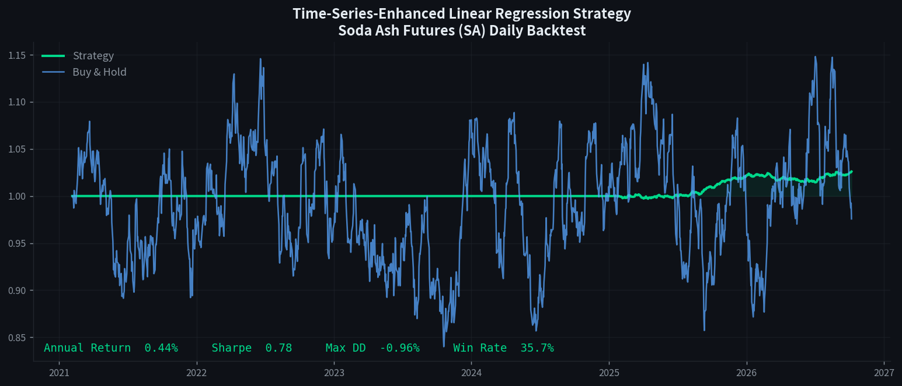

# 纯碱期货量化交易策略 —— 基于时间序列增强线性回归



> 利用时间序列特征增强的线性回归模型预测纯碱（SA）期货价格走势，并构建多空投机策略，通过 Walk-Forward 滚动回测验证策略有效性。

## 📌 项目简介

纯碱期货是化工板块的重要品种，价格受供需、库存、宏观经济等多因素影响，具有较强的趋势性与波动性。本项目尝试用**时间序列特征增强的线性回归模型**对其日收益率进行预测，并据此生成多空交易信号，配合止损止盈与仓位管理完成回测。

所谓"时间序列增强"，核心在于两点：

1. **特征层面**：为线性回归引入大量时间序列特征——滞后项、滚动均值/波动率、RSI、MACD、布林带、ATR 等，使 OLS 能够捕捉价格序列中的时序依赖；
2. **建模层面**：采用 **Walk-Forward 滚动训练**避免未来函数，并对残差做 **AR(1) 自回归修正**，进一步提升预测精度。

## 🛠 技术栈

| 类别 | 工具 |
|------|------|
| 语言 | Python 3.8+ |
| 数据处理 | Pandas, NumPy |
| 机器学习 | Scikit-learn (LinearRegression / Ridge) |
| 可视化 | Matplotlib |
| 回测 | 自研向量化回测引擎 |

## 🧩 核心方法

### 1. 特征工程 (`src/features.py`)

- **滞后项**：`close_lag1/2/3/5/10`
- **滚动统计**：`ma5/10/20`, `std5/10/20`, `max/min`, 区间收益率
- **技术指标**：RSI(14)、MACD、布林带(20,2)、ATR(14)、量比

### 2. 模型 (`src/model.py`)

- 基线：Ridge 回归（带 L2 正则）
- 增强：残差 AR(1) 修正 —— `ŷ = Xβ + φ·ε_{t-1}`
- 训练：Walk-Forward 滚动窗口，每 60 个样本重训练一次

### 3. 策略 (`src/strategy.py`)

- 预测收益率 > 阈值 → 做多
- 预测收益率 < -阈值 → 做空
- 止损 2% / 止盈 5%
- 次日开盘执行，避免未来函数

### 4. 回测 (`src/backtest.py`)

- 初始资金 100 万，纯碱合约乘数 20 吨/手
- 手续费万三，滑点 1 元/吨
- 指标：年化收益、夏普比率、最大回撤、胜率、盈亏比

## 📂 目录结构

```
soda-ash-futures-strategy/
├── main.py                 # 入口脚本
├── src/
│   ├── config.py           # 全局参数配置
│   ├── data_loader.py      # 数据加载（含合成样本数据）
│   ├── features.py         # 时间序列特征工程
│   ├── model.py            # 增强线性回归 + Walk-Forward
│   ├── strategy.py         # 交易信号与风控
│   ├── backtest.py         # 回测引擎与绩效指标
│   └── visualization.py    # 净值曲线/回撤/信号可视化
├── data/                   # 行情数据（CSV）
├── results/                # 回测结果与图表
├── notebooks/              # 探索性分析
├── requirements.txt
└── README.md
```

## 🚀 快速开始

```bash
# 1. 安装依赖
pip install -r requirements.txt

# 2. 运行回测（默认使用合成样本数据）
python main.py

# 3. 使用自己的行情数据
python main.py --data data/soda_ash_futures.csv
```

> 数据 CSV 需包含 `date, open, high, low, close, volume` 列。

> README 首图由 `make_banner.py` 生成，需要重新生成时运行 `python make_banner.py`。

## 📊 回测结果

运行 `python main.py` 后将在 `results/backtest_result.png` 生成净值曲线、回撤图与交易信号图，控制台输出绩效指标（以下为合成样本数据上的示例结果，换成真实行情数据后重新跑一遍即可）：

```
总收益率(%)       : 2.60
年化收益率(%)     : 0.44
年化波动率(%)     : 0.56
夏普比率          : 0.784
最大回撤(%)       : -0.96
交易次数          : 171
胜率(%)           : 35.67
盈亏比            : 1.34
期末权益          : 1026015.98
```

## ⚠️ 风险提示

本项目仅用于学习与研究，回测结果不构成任何投资建议。期货交易具有高杠杆与高风险，实盘交易请谨慎。

## 📝 可改进方向

- [ ] 引入跨品种价差、库存等基本面特征
- [ ] 尝试 LightGBM / LSTM 等非线性模型对比
- [ ] 增加仓位优化（凯利公式、风险平价）
- [ ] 实盘对接（CTP / 掘金量化）
